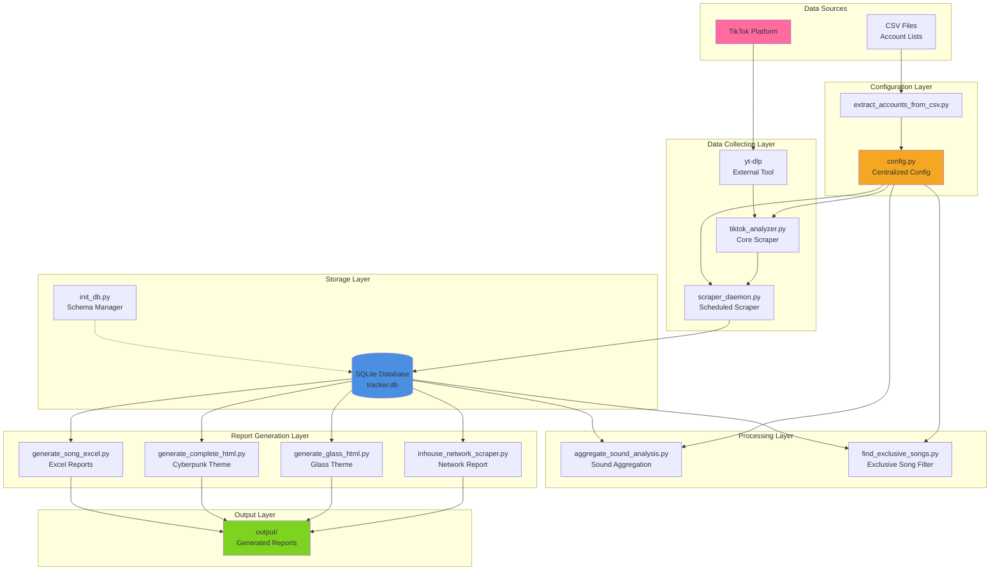
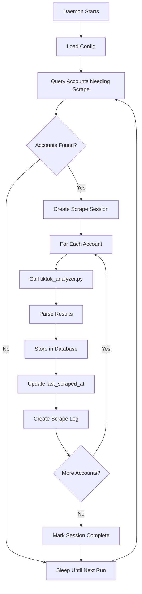
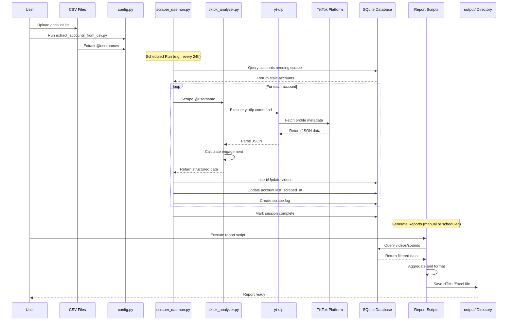
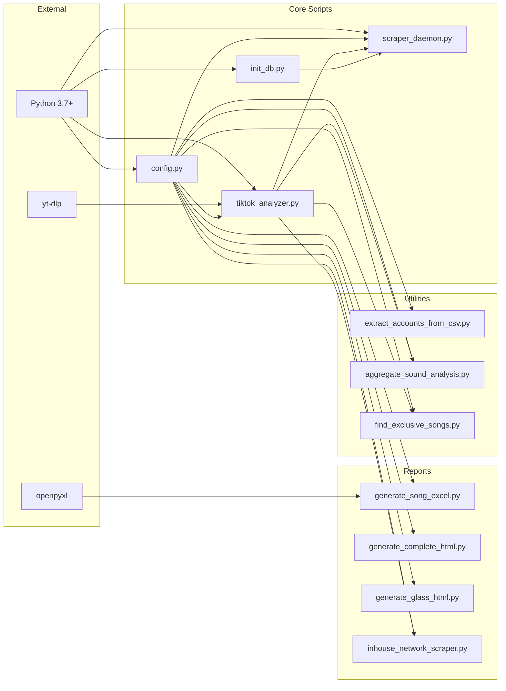

# Warner Sound Tracker - System Architecture

## Overview

The Warner Sound Tracker is a data pipeline system designed to scrape, store, analyze, and report on TikTok content across multiple Warner Music Group accounts. This document describes the system architecture, data flow, components, and design decisions.

## High-Level Architecture



## System Components

### 1. Configuration Layer

**Purpose:** Centralize all configuration and account management

**Components:**
- `config.py` - Single source of truth for all settings
- `extract_accounts_from_csv.py` - Utility to parse account lists from CSV files

**Key Configuration:**
```python
ACCOUNTS = ['@account1', '@account2', ...]  # Accounts to track
TARGET_ACCOUNTS = {'@account1', ...}         # Subset for exclusive analysis
EXCLUSIVE_SONGS = {'Song - Artist', ...}     # Songs to filter
CUTOFF_DATE = datetime(2025, 10, 1)         # Date filter
OUTPUT_DIR = PROJECT_ROOT / 'output'        # Report output location
```

**Design Decision:** Centralized configuration eliminates hardcoded values and enables easy updates across all scripts.

---

### 2. Data Collection Layer

**Purpose:** Scrape TikTok data and handle external API interactions

#### 2.1 yt-dlp (External Dependency)

**Type:** Command-line tool (external)

**Purpose:** Scrape TikTok metadata without downloading videos

**Why yt-dlp?**
- ✅ No TikTok API key required
- ✅ Handles authentication and rate limiting
- ✅ Returns structured JSON metadata
- ✅ Actively maintained, adapts to TikTok changes
- ❌ Fragile (breaks if TikTok changes structure)
- ❌ Slower than official API

**Usage:**
```bash
yt-dlp --flat-playlist --print-json "https://www.tiktok.com/@username"
```

#### 2.2 tiktok_analyzer.py (Core Scraper)

**Type:** Python script (reusable module)

**Purpose:** Wrapper around yt-dlp for single-account scraping

**Input:** TikTok username, video limit
**Output:** Structured data (views, likes, engagement, sound info)

**Key Features:**
- Subprocess management of yt-dlp
- JSON parsing and validation
- Engagement rate calculation
- Error handling and retries
- Date filtering support

**Usage:**
```python
python3 tiktok_analyzer.py --url @username --limit 50
```

#### 2.3 scraper_daemon.py (Scheduled Scraper)

**Type:** Python daemon/service (coming soon)

**Purpose:** Automated, incremental scraping with timestamp tracking

**Key Features:**
- Checks `accounts.last_scraped_at` to determine what needs scraping
- Only scrapes accounts older than configured threshold (e.g., 24 hours)
- Stores data in SQLite database
- Creates scrape session logs
- Handles errors gracefully (continues on failure)
- Configurable via cron or task scheduler

**Workflow:**


---

### 3. Storage Layer

**Purpose:** Persistent data storage with relational structure

#### 3.1 SQLite Database (tracker.db)

**Why SQLite?**
- ✅ Zero-configuration (no server needed)
- ✅ Single file database (easy backup)
- ✅ ACID compliance (reliable)
- ✅ Fast for this use case (<1M rows)
- ✅ SQL query capabilities
- ❌ Not suitable for concurrent writes
- ❌ Limited to single machine

**Schema Overview:**
- `accounts` - TikTok accounts tracked
- `videos` - Individual video records
- `sounds` - Aggregated sound/song data
- `scrape_sessions` - Job history
- `scrape_logs` - Per-account logs
- `video_history` - Historical metric snapshots
- `exclusive_songs` - Songs to filter

See [DATABASE_SCHEMA.md](DATABASE_SCHEMA.md) for detailed schema documentation.

#### 3.2 init_db.py (Schema Manager)

**Purpose:** Initialize, reset, and manage database schema

**Usage:**
```bash
python3 init_db.py           # Create/initialize database
python3 init_db.py --reset   # Drop and recreate (WARNING: data loss)
python3 init_db.py --info    # Show database statistics
```

---

### 4. Processing Layer

**Purpose:** Analyze and transform scraped data

#### 4.1 aggregate_sound_analysis.py

**Purpose:** Aggregate video data by sound/song across multiple accounts

**Input:** List of accounts (from config)
**Output:** Terminal output with aggregated sound statistics

**Algorithm:**
1. Scrape all configured accounts
2. Group videos by `sound_key` ("Song Title - Artist Name")
3. Calculate aggregated metrics (total views, avg engagement)
4. Rank sounds by performance
5. Show top videos for each sound

**Use Case:** Understanding which sounds perform best across the network

#### 4.2 find_exclusive_songs.py

**Purpose:** Identify songs used ONLY by Warner target accounts

**Input:** Target accounts, all accounts, date filter
**Output:** List of exclusive songs in `sound_key` format

**Algorithm:**
1. Scrape all accounts for specified time period
2. Build map of `sound → set of accounts using it`
3. Identify sounds where ALL users are in TARGET_ACCOUNTS
4. Output list in Python set format for `config.py`

**Use Case:** Filtering out exclusive Warner content from reports

---

### 5. Report Generation Layer

**Purpose:** Create visual and exportable reports from database data

#### 5.1 generate_song_excel.py

**Output:** Excel spreadsheet organized by song

**Structure:**
- One sheet per shared song
- Columns: Account, TikTok URL, Upload Date, Views, Likes, Comments, Shares
- Styled headers with freeze panes
- Auto-adjusted column widths

**Use Case:** Sharing structured data with non-technical stakeholders

#### 5.2 generate_complete_html.py

**Output:** Cyberpunk-themed HTML report

**Design:**
- Purple/blue gradient theme
- Animated drift background
- Engagement badges (high/medium/low)
- Complete video tables per sound
- Self-contained HTML (embedded CSS)

**Use Case:** Visual presentation for internal review

#### 5.3 generate_glass_html.py

**Output:** Glassmorphism-themed HTML report

**Design:**
- Translucent backgrounds with backdrop blur
- Clean typography
- Purple accent color scheme
- Modern, professional aesthetic

**Use Case:** Polished reports for management

#### 5.4 inhouse_network_scraper.py

**Output:** Comprehensive network HTML report with dual views

**Structure:**
- **Sound View:** All sounds with usage stats across network
- **Account View:** Performance rankings per account
- Date filtering (configurable cutoff)
- Exclusive song filtering

**Use Case:** Main production tool for full network analysis

---

## Data Flow Diagrams

### Complete Data Pipeline



### Incremental Scraping Flow

```mermaid
flowchart TD
    START[Scraper Daemon Starts] --> CONNECT[Connect to Database]
    CONNECT --> QUERY[Query: SELECT * FROM accounts<br/>WHERE last_scraped_at < NOW() - 24h]

    QUERY --> CHECK{Accounts<br/>Found?}
    CHECK -->|No| SLEEP[Sleep 1 Hour]
    SLEEP --> QUERY

    CHECK -->|Yes| SESSION[Create scrape_session<br/>session_id = UUID<br/>status = 'running']

    SESSION --> LOOPSTART[For Each Account]
    LOOPSTART --> GETLAST[Get account.last_scraped_at]

    GETLAST --> SCRAPE[Scrape with date filter:<br/>only videos after last_scraped_at]

    SCRAPE --> COMPARE{New Videos?}
    COMPARE -->|Yes| INSERT[Insert new videos<br/>Update existing videos<br/>Create history snapshots]
    COMPARE -->|No| SKIP[Log: No new content]

    INSERT --> UPDATEACC[UPDATE accounts<br/>SET last_scraped_at = NOW()<br/>scrape_count = scrape_count + 1]
    SKIP --> UPDATEACC

    UPDATEACC --> LOGENTRY[INSERT INTO scrape_logs]
    LOGENTRY --> MOREACCTS{More<br/>Accounts?}

    MOREACCTS -->|Yes| LOOPSTART
    MOREACCTS -->|No| CLOSESESSION[UPDATE scrape_session<br/>SET status = 'completed'<br/>end_time = NOW()]

    CLOSESESSION --> SLEEP
```

---

## Design Decisions

### Why Python?

**Pros:**
- ✅ Rich ecosystem (openpyxl, sqlite3)
- ✅ Easy subprocess management for yt-dlp
- ✅ Rapid development
- ✅ Cross-platform compatibility
- ✅ Readable code for maintenance

**Cons:**
- ❌ Slower than compiled languages (not critical for this use case)
- ❌ GIL limits multi-threading (can use multiprocessing)

### Why SQLite vs PostgreSQL/MySQL?

| Feature | SQLite | PostgreSQL |
|---------|--------|------------|
| Setup | Zero-config | Requires server |
| Performance (reads) | Fast | Fast |
| Performance (writes) | Fast (single thread) | Fast (multi-thread) |
| Concurrent writes | Limited | Excellent |
| Backup | Copy file | pg_dump |
| Use case | Single machine | Distributed systems |

**Decision:** SQLite is sufficient for:
- Single daemon writing sequentially
- Read queries are fast with proper indexes
- Data volume is small (<1M videos)
- Easy backup and portability

**Migration path:** If concurrent access is needed, can migrate to PostgreSQL later.

### Why yt-dlp vs TikTok Official API?

| Feature | yt-dlp | TikTok API |
|---------|--------|------------|
| Authentication | None needed | Requires API key |
| Rate limits | Soft limits | Hard limits |
| Cost | Free | May have costs |
| Reliability | Fragile (scraping) | Stable |
| Setup time | Instant | Application process |
| Data richness | Good | Better |

**Decision:** yt-dlp chosen for:
- No API key application process
- Immediate setup
- Sufficient data for analytics needs
- Active community maintains compatibility

**Risk mitigation:**
- Implement error handling
- Add retry logic
- Monitor for breaking changes
- Have fallback manual export process

### Reporting: HTML vs Dashboard?

**Current:** Static HTML/Excel files
**Future:** Web dashboard with live data

**Why static reports initially?**
- ✅ Simple to implement
- ✅ Easy to share (email attachment)
- ✅ No hosting required
- ✅ Self-contained files
- ❌ Not real-time
- ❌ No interactivity

**Migration path:**
- Phase 1: Static reports (current)
- Phase 2: Add REST API for data access
- Phase 3: Build web dashboard (React/Vue)
- Phase 4: Real-time updates with WebSockets

---

## Component Dependencies



---

## Scalability Considerations

### Current Limitations

| Aspect | Current | Bottleneck |
|--------|---------|------------|
| Accounts | 50 | yt-dlp rate limits |
| Videos per scrape | ~10,000 | Processing time |
| Scraping speed | Sequential | Single-threaded |
| Database size | <100 MB | SQLite works fine |
| Report generation | In-memory | Memory usage |

### Scaling Strategies

#### 1. Parallel Scraping

**Current:** Sequential (one account at a time)

**Improvement:** Multi-threaded scraping
```python
from concurrent.futures import ThreadPoolExecutor

with ThreadPoolExecutor(max_workers=5) as executor:
    futures = [executor.submit(scrape_account, acc) for acc in accounts]
```

**Expected improvement:** 3-5x faster

#### 2. Caching

**Problem:** Re-scraping unchanged videos wastes time

**Solution:** Check video_id before full parse
```python
existing_ids = set(db.get_video_ids())
new_videos = [v for v in scraped if v['id'] not in existing_ids]
```

**Expected improvement:** 50% reduction in processing time

#### 3. Database Optimization

**Current:** Simple indexes

**Improvements:**
- Partial indexes for common queries
- Materialized views for aggregations
- Query result caching

#### 4. Distributed Scraping

**For 500+ accounts:**
- Deploy multiple scraper instances
- Partition accounts across scrapers
- Central database for aggregation
- Message queue for coordination (RabbitMQ/Redis)

---

## Security & Privacy

### Data Sensitivity

| Data Type | Sensitivity | Mitigation |
|-----------|-------------|------------|
| Account usernames | Low (public) | None needed |
| Video URLs | Low (public) | None needed |
| Engagement metrics | Low (public) | None needed |
| CSV files | Medium (internal) | Exclude from git |
| Database | Medium (aggregated) | File permissions (600) |

### Best Practices

1. **Never commit sensitive data to git**
   - `.gitignore` excludes `data/` and `*.db`

2. **File permissions**
   ```bash
   chmod 600 tracker.db  # Only owner can read/write
   ```

3. **SQL injection prevention**
   - Always use parameterized queries
   ```python
   cursor.execute('SELECT * FROM videos WHERE video_id = ?', (video_id,))
   ```

4. **Rate limiting**
   - Respect TikTok's rate limits
   - Add delays between requests
   - Monitor for 429 errors

5. **Error logging**
   - Don't log sensitive data in error messages
   - Sanitize URLs before logging

---

## Monitoring & Observability

### Metrics to Track

1. **Scraping Health**
   - Success rate per session
   - Average scrape duration
   - Failed account count
   - Error types distribution

2. **Data Quality**
   - Missing sound information %
   - Zero-view videos %
   - Duplicate video_id attempts

3. **Performance**
   - Scrape duration per account
   - Database query times
   - Report generation time

### Monitoring Query

```sql
-- Last 10 scraping sessions summary
SELECT
    session_id,
    start_time,
    status,
    total_accounts,
    successful_scrapes,
    failed_scrapes,
    ROUND((successful_scrapes * 100.0 / total_accounts), 2) AS success_rate_pct,
    total_new_videos,
    ROUND((julianday(end_time) - julianday(start_time)) * 24 * 60, 2) AS duration_minutes
FROM scrape_sessions
ORDER BY start_time DESC
LIMIT 10;
```

### Alert Conditions

- Success rate < 80%
- Scrape duration > 2x average
- No scrapes in last 48 hours
- Database size > 500 MB (indicates potential issue)

---

## Future Enhancements

### Phase 1: Automation (Current Goal)
- ✅ SQLite database
- ✅ Database schema
- 🚧 `scraper_daemon.py`
- 🚧 Cron job setup
- 🚧 Timestamp-based incremental scraping

### Phase 2: Reliability
- Error retry logic
- Email/Slack notifications
- Monitoring dashboard
- Automated backups
- Health checks

### Phase 3: Performance
- Parallel scraping
- Caching layer
- Query optimization
- Result pagination

### Phase 4: Platform
- REST API
- Web dashboard (React/Vue)
- User authentication
- Real-time updates
- Historical trend charts

### Phase 5: Advanced Analytics
- Predictive modeling (which sounds will trend?)
- Anomaly detection (unusual engagement patterns)
- Competitor analysis
- A/B testing support

---

## Technology Stack Summary

| Layer | Technology | Purpose |
|-------|------------|---------|
| Language | Python 3.7+ | Core development |
| Data Collection | yt-dlp | TikTok scraping |
| Database | SQLite 3 | Persistent storage |
| Excel | openpyxl | Report generation |
| HTML | Native string concat | Report generation |
| Scheduling | Cron / Task Scheduler | Automation |
| Version Control | Git + GitHub | Code management |

---

## Related Documentation

- [README.md](README.md) - Project overview and quick start
- [DATABASE_SCHEMA.md](DATABASE_SCHEMA.md) - Detailed database schema
- [TRACKER_DOCUMENTATION.md](TRACKER_DOCUMENTATION.md) - Technical documentation
- [DEPLOYMENT.md](DEPLOYMENT.md) - Production deployment guide
- [CRON_SETUP.md](CRON_SETUP.md) - Automated scheduling setup

---

**Last Updated:** November 2025
**Architecture Version:** 1.0
